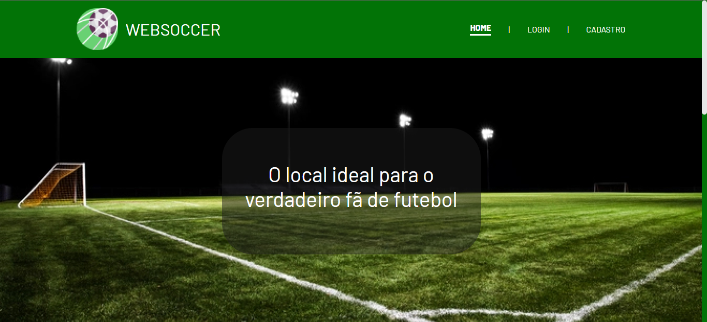

# WebSoccer

A WebSoccer é uma página web sobre futebol onde você consegue acessar fazendo seu login e saber sobre alguns times de futebol, além disso a WebSoccer contém um quiz para você testar seus conhecimentos!  

# Linguagens utilizadas

## Screenshots

## Autores

- [@KauanCavazani](https://www.github.com/KauanCavazani)

